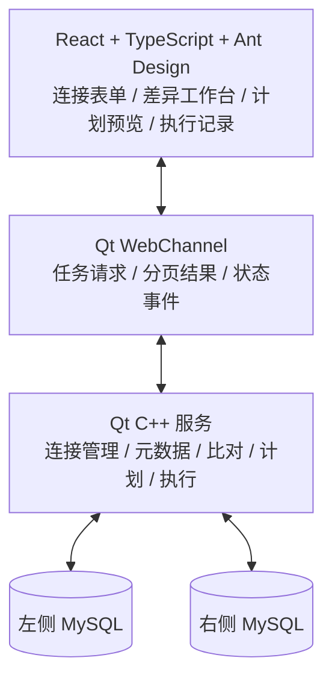

# 功能可行性与架构方向

核查日期：2026-09-15。结论为设计可行，不是运行通过。未安装业务依赖、构建 Qt 工程或接入真实数据库。

## 1. 总体结论

Qt6 + React + Ant Design 可承载该工具。真正的难点是结构差异规范化、变更依赖排序、数据身份与类型精度、部分失败和并发变化处理。界面展示与双平台外壳有成熟组件；同步正确性需要后续用代表性 MySQL 样本验证。

| 能力 | 可行性判断 | 工作重点 | 后续验证 |
| --- | --- | --- | --- |
| Qt 承载 React | 有官方能力基础 | WebEngine 加载本地前端资源，WebChannel 异步桥接 | 双平台加载、字体/缩放、桥接错误与资源路径 |
| MySQL 连接 | 有官方驱动方案 | Qt SQL 的 QMYSQL 插件及客户端库随包交付 | 驱动版本/架构、认证、TLS、干净机器加载 |
| 结构元数据读取 | 可行 | INFORMATION_SCHEMA 与 SHOW CREATE 互补；缺权限单独报错 | 目标版本字段、索引、约束、触发器样本 |
| 字段/索引差异 | 可行，规则密集 | 类型语义、默认值、顺序、函数索引等不能只靠文本差分 | 同义定义、真实差异、异常定义 |
| 结构同步 | 可行，有条件 | ALTER 组合、对象依赖、版本能力、已有数据约束 | 数据导致的 DDL 失败、锁等待、部分成功 |
| 触发器同步 | 可行，有条件 | 替换顺序、执行上下文、DEFINER、引用关系 | 两端权限、创建失败、相同事件多个触发器 |
| 数据比对 | 可行，有条件 | 唯一匹配键、精确值、范围与分页一致性 | 复合键、NULL、JSON、大整数、重复键 |
| 数据同步 | 可行，有条件 | 明确模式、分批事务、并发冲突、目标触发器 | 三种模式、约束失败、断线结果未知 |
| 大表与持续写入 | 需样本验证 | 扫描成本、内存上限、并发窗口、取消语义 | 不设未经测量的毫秒或百万行指标 |
| Windows/macOS 发布 | 可行，必须各自实测 | WebEngine 资源、SQL 插件、客户端库、CPU 架构 | 本机开发通过不能替代另一平台验收 |

## 2. 版本事实与验证界限

前序本任务已通过 npm Registry 查询确认：react@19.2.7、typescript@6.0.3、antd@6.4.5 存在；antd 的 react/react-dom peerDependencies 为 >=18.0.0。这支持依赖范围可配合，不证明整套构建与类型检查已通过。

Qt 官方提供 QWebEngineView 以嵌入网页，WebChannel 可异步访问导出的 QObject。推荐 React 仅负责显示与交互，C++ 负责数据库连接、比对计划与执行；无须为本地单机工具额外引入远程业务服务。[Qt WebEngine](https://doc.qt.io/qt-6/qtwebengine-overview.html)、[Qt WebChannel](https://doc.qt.io/qt-6/qtwebchannel-javascript.html)

QMYSQL 依赖相应客户端库和驱动插件；不能假设安装 Qt 后天然已有可分发的 MySQL 插件。具体 Qt 次版本、插件构建和客户端库方案放到 D1 验证。[Qt SQL 驱动](https://doc.qt.io/qt-6/sql-driver.html)

Ant Design 提供分栏组件 Splitter，并可通过 ConfigProvider 统一主题。适合重用 Table、Tabs、Form、Drawer、Modal 等；不需要另造一套控件库。官方网页随版本更新，后续实现须以锁定的 6.4.5 包类型和实际行为为准。[Splitter](https://ant.design/components/splitter/)、[ConfigProvider](https://ant.design/components/config-provider/)

## 3. 推荐分层

这是职责建议，不在本次确定目录结构、类名、API 字段或 SQL 模板。数据库任务在工作线程处理，避免阻塞窗口；桥接只传分页结果和摘要。任务标识用于让刷新前的旧结果不覆盖新请求。数据库连接的线程归属由后续 Qt 工程验证，不跨线程随意复用。

本地只需保存连接元信息、偏好和有限执行记录。具体用 JSON 还是 SQLite 在工程 change 中选最简单方案；不为未来可能的团队协作引入服务端或消息队列。

## 4. 结构同步需要明确的技术边界

### 元数据不等于可执行脚本

SHOW CREATE 可以保留定义细节，结构化元数据适合按字段展示差异。两者结合优于只比较字符串。定义中对象名、生成表达式、注释、默认值、版本能力必须区别处理。[SHOW CREATE TABLE](https://dev.mysql.com/doc/refman/8.4/en/show-create-table.html)

### DDL 不是任意可回滚事务

MySQL 的多种 DDL 会隐式提交；不要把若干 ALTER/DROP/CREATE 包在一个事务里就承诺整体撤销。计划按真实执行单元显示结果，失败后重新读取已发生的状态。保存原 DDL 有助排查，但不能恢复已丢失的列数据。[隐式提交](https://dev.mysql.com/doc/refman/8.4/en/implicit-commit.html)

### 结构变更可能受数据和锁影响

类型缩窄、唯一索引、NOT NULL、外键等可能因既有数据失败；ALTER 的算法和锁行为取决于操作与版本。不统一承诺即时、无锁；让计划显示“可能重建表/等待锁”等适用提示，并在实际不支持时停止。[ALTER TABLE](https://dev.mysql.com/doc/refman/8.4/en/alter-table.html)

### 触发器不是只复制正文

创建语义涉及 DEFINER、触发事件/时机、执行顺序与 sql_mode。导出脚本中的 DELIMITER 是客户端语法，不应作为数据库协议语句直接执行。直接发送完整触发器定义，不能按分号随意拆割正文。[CREATE TRIGGER](https://dev.mysql.com/doc/refman/8.4/en/create-trigger.html)

## 5. 数据同步需要明确的技术边界

### 快照与并发

InnoDB 一致性读可以为单个事务提供一致读取视图，但不提供跨两台服务器的统一时刻快照。应用应分别记录读取上下文，并在写入目标前检测改变；某些 DDL 还会影响读取有效性。[一致性非锁定读](https://dev.mysql.com/doc/refman/8.4/en/innodb-consistent-read.html)

### 数据身份与类型

可靠主键/唯一键是判断“同一条记录”的基础。无键、可空或实际不唯一的映射不能用于自动更新和删除。BIGINT/DECIMAL 跨 JavaScript 边界需避免精度损失；日期时区、二进制、JSON 语义和排序规则影响相等判定。以上是实现验证项，不在本次固定比较算法。

### 分批执行

大表不能要求前端持有全部数据，也不能默认一条巨型 SQL 或一个无限长事务。逐批处理需要区分待执行、当前批、已提交与未确认。事务失败能撤销的范围只按实际提交边界表述。先覆盖 InnoDB 的可验证行为，其他引擎进入能力受限状态。

## 6. 不必在本次定死的实现决策

Qt 具体次版本、构建工具版本、最低 OS/CPU 架构、Qt 驱动分发、数据比较算法、批次大小、结果缓存介质、索引选择、格式化与差分编辑器库。它们在后续对应 change 中结合真实样本决定，不能被“总体规划已确认”误读成所有版本与性能承诺。

## 7. 后续最小验证样本

| 样本 | 验证目的 |
| --- | --- |
| 普通 InnoDB 表，含 NULL/默认值/索引 | 常用结构与数据闭环 |
| 生成列、函数/不可见索引、CHECK | 版本能力识别与不支持降级 |
| 触发器引用其他表，DEFINER 不同 | 上下文与副作用边界 |
| 有外键且被其他表引用 | 单表范围不被依赖暗中扩大 |
| 复合主键、BIGINT/DECIMAL、JSON/BLOB | 键、类型精度、长值展示 |
| 无主键、可空唯一键、冲突记录 | 禁用不可靠同步路径 |
| 筛选范围内外存在同键记录 | 完全对齐不越界 |
| 执行时改值、锁等待、断线 | 冲突、停止、结果未知与重新比对 |

本轮证据：官方文档读取与前序 Registry 版本查询。未运行：构建、原生桥接、数据库比对、同步 SQL、性能测试、Windows/macOS 包验证。
